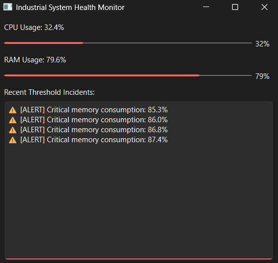

# System Monitor & Log Analyzer

This app monitors CPU and RAM usage in real time and automatically logs an alert whenever usage crosses 80%. It polls system metrics every 2 seconds using `psutil`, displays them live through a PySide6 GUI, and stores triggered alerts in a local SQLite database. I built it to strengthen my skills in GUI development, real-time data polling, and database integration in Python.

## Features

- Real-time CPU and RAM usage tracking with a live-updating GUI
- Automatic alert logging when CPU exceeds 80% or RAM exceeds 85%
- Persistent local storage of alerts using SQLite

## Tech Stack

- **GUI:** PySide6 (Qt for Python)
- **System Metrics:** psutil
- **Data Storage:** SQLite3
- **Language:** Python 3.13

## Setup & Installation

1. Clone this repository:

git clone https://github.com/YOUR-USERNAME/SystemMonitor.git

cd SystemMonitor

2. Create and activate a virtual environment:

python -m venv .venv
.venv\Scripts\activate

3. Install dependencies:
pip install -r requirements.txt

4. Run the app:
python main.py

## Architecture

The project separates concerns between two files:

- `database.py` handles all SQLite operations — creating the alerts table and inserting new alert records.
- `main.py` builds the GUI using PySide6, polls system stats on a `QTimer` every 2 seconds, and calls into `database.py` whenever a threshold is crossed.

This separation keeps the storage logic independent of the UI, making each piece easier to test and extend on its own.

## Roadmap

- [x] Add dark theme styling
- [x] Add a historical alerts view with a filterable table
- [x] Add filtering and clear controls to alert history
- [ ] Package as a standalone executable